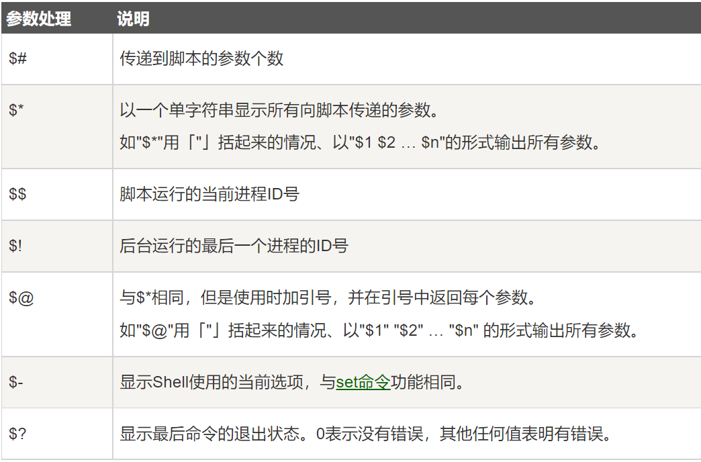
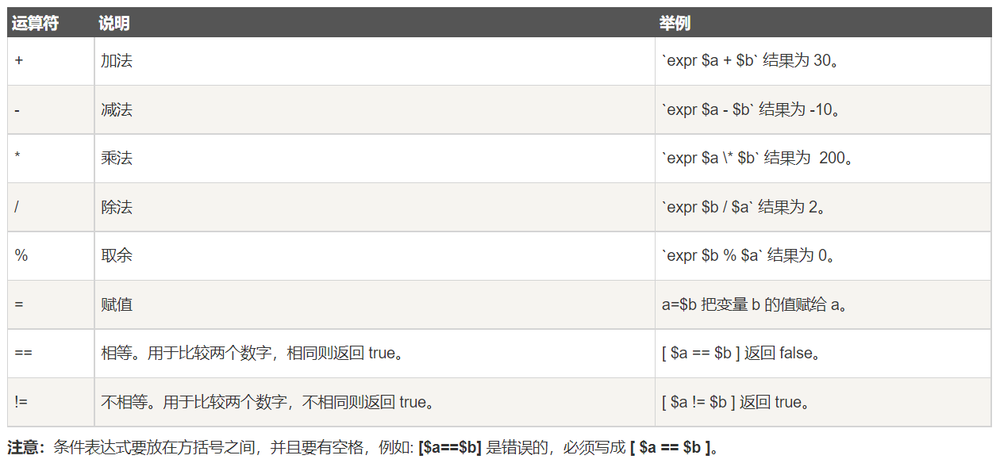
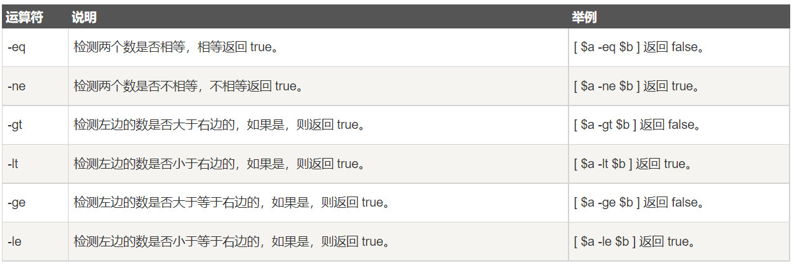
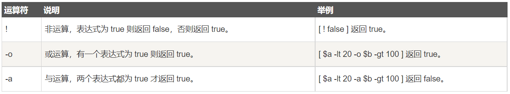
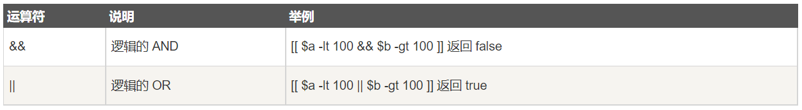
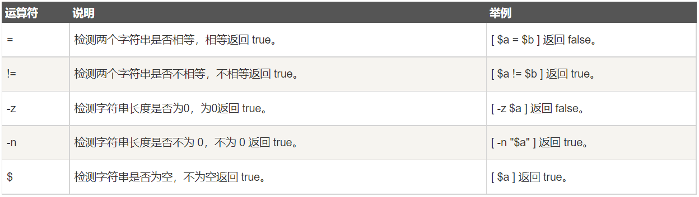
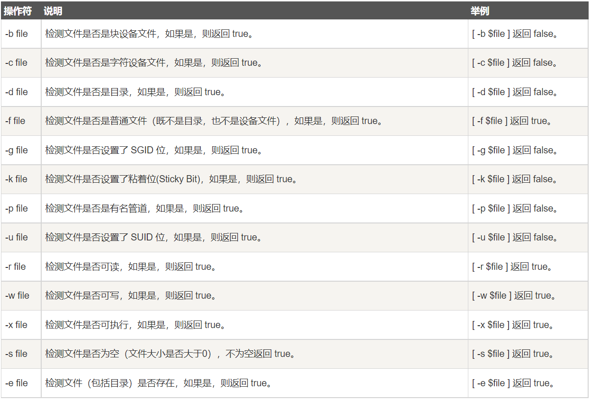
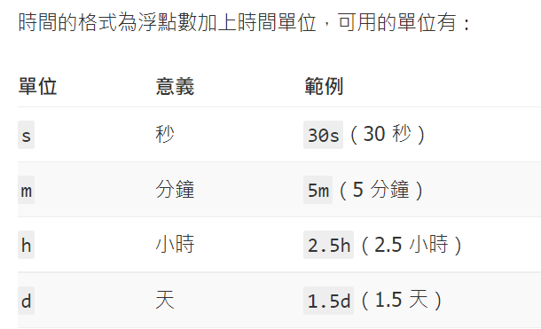
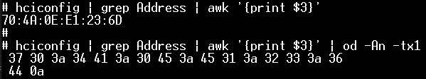
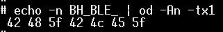

```Text
Author: <weng851107@gmail.com>

This file is only used for the record of the learning process, only used
by myself and the file has never been leaked out.

If there is related infringement or violation of related regulations, please 
contact me and the related files will be deleted immediately. Thank you!
```

# 目錄

- [Introduction](#1)
  - [[shell十三問]](#1.1)
  - [Difference between Bash Script and Shell Script](#1.2)
- [學習資源](#2)
  - [菜鳥教程](#2.1)
    - [變量](#2.1.1)
      - [1. 只讀變量](#2.1.1.1)
      - [2. 刪除變量](#2.1.1.2)
      - [3. 獲取字符串長度](#2.1.1.3)
      - [4. 陣列(組數)](#2.1.1.4)
    - [傳遞參數](#2.1.2)
    - [基本運算符](#2.1.3)
      - [1. 算術運算符](#2.1.3.1)
      - [2. 關係運算符](#2.1.3.2)
      - [3. 布爾運算符](#2.1.3.3)
      - [4. 邏輯運算符](#2.1.3.4)
      - [5. 字符串運算符](#2.1.3.5)
      - [6. 文件測試運算符](#2.1.3.6)
    - [流程控制](#2.1.4)
    - [函數](#2.1.5)
    - [輸入/輸出重定向](#2.1.6)
  - [「程式筆記」Shell Script 簡易筆記](#2.2)
- [實際操作](#3)
  - [Command](#3.1)
    - [grep用法](#3.1.1)
    - [sed用法](#3.1.2)
    - [awk用法](#3.1.3)
    - [cut用法](#3.1.4)
    - [timeout](#3.1.5)
    - [tr命令](#3.1.6)
    - [cmp 文字比較指令](#3.1.7)
    - [diff 文字比較指令](#3.1.8)
    - [hexdump](#3.1.9)
    - [echo](#3.1.10)
    - [printf](#3.1.11)
    - [seq](#3.1.12)
    - [wc 求檔案列數](#3.1.13)
    - [od](#3.1.14)
    - [kill、killall等指令強迫關閉程式](#3.1.15)
    - [dd (data duplicator)](#3.1.16)
    - [shuf 亂數](#3.1.17)
    - [xargs](#3.1.18)
    - [date & hwclock](#3.1.19)
    - [blkid](#3.1.20)
    - [sync](#3.1.21)
    - [journalctl︰查詢 systemd 日誌](#3.1.22)
    - [dos2unix & unix2dos](#3.1.23)
  - [單引號('')、雙引號("")，反引號（``）的區別](#3.2)
  - [小括號(), 中括號[], 和大括號{}的區別](#3.3)
  - [常用参数(文件/目錄, 字符串, 邏輯判斷)](#3.4)
  - [進制轉換](#3.5)
  - [求兩個數相除後的百分比](#3.6)
  - [回傳值](#3.7)
  - [bitwise operation](#3.8)


<h1 id="1">Introduction</h1>

<h2 id="1.1">[shell十三問]</h2>

(https://jasonblog.github.io/note/shell/230.html)

- 計算機的運作不能離開硬件，但使用者卻無法直接操作硬件， 硬件的驅動只能通過一種稱為`操作系統(OS，Opertating System)`的軟件來管控。
- 每天所談的`linux`，嚴格來說只是一個操作系統(OS), 我們稱之為`內核(kernel)`。
- 使用者沒有辦法直接操作一個kernel， 而是通過kernel的`外殼`程序，也就是所謂的shell，來與kernel溝通。
- shell是一個使用者與系統的交互界面(interface), 只能讓使用者通過命令行(command line)來使用系統來完成工作。
- 若從進程(process)的角度來說，我們在shell所下達的命令，均是shell所產生的子進程。 這種現象，我暫可稱之為fork。
- 如果是執行shell腳本(shell script)的話，腳本中命令則是由另一個非交互模式的 子shell(sub shell)來執行的。
- `kernel` 與 `shell` 是不同的兩套軟件，而且都是可以被替換的:
  - 不同的OS使用不同的kernel;
  - 同一個kernel之上，也可以使用不同的shell;

---

- `遊標(cursor)`作用就是告訴你接下來你從鍵盤輸入的按鍵所插入的位置， 且每輸入一個鍵，cursor便向右移動一個格子， 如果連續輸入太多的話，則自動接在下一行輸入。直到碰到命令行讀進CR(Carriage Return, 由Enter鍵產生)字符為止。
- `提示符` :`shell prompt`的意思很簡單： 告訴shell使用者，您現在可以輸入命令行了。CR的意思也很簡單： 使用者告訴shell：老兄，你可以執行的我命令行了。
  - $: 給一般用戶賬號使用;
  - #: 給root(管理員)賬號使用;
- 所謂的命令行， 就是在`shell prompt`與`CR`之間所輸入的文字。

---

- 標準的`command line`三個組成部分：`command_name` `option` `argument`
- echo將argument送出到標準輸出`(stdout)`,通常是在監視器`(monitor)`上輸出。

   ```TextPlain
   在linux系統中任何一個進程默認打開三個文件：stdin、stdout、stderr.

   stdin 標準輸入

   stdout 標準輸出

   stderr 標準錯誤輸出
   ```

---

- command line的每一個`charactor`, 分為如下兩種：
  - literal：也就是普通的純文字，對shell來說沒特殊功能；
  - meta: 對shell來說，具有特定功能的特殊保留元字符。
    - Ex. 
      `IFS`：有`space`或者`tab`或者`Enter`三者之一組成(我們常用space)
      `CR`：由`Enter`產生；

- 假如我們需要在command line中將這些保留元字符的功能關閉的話， 就需要`quoting`處理了。在`bash`中，常用的quoting有以下三種方法：
  - hard quote：''(單引號)，凡在hard quote中的所有meta均被關閉；
  - soft quote：""(雙引號)，凡在soft quote中大部分meta都會被關閉，但某些會保留(如$);
  - escape: \ (反斜槓)，只有在緊接在escape(跳脫字符)之後的單一meta才被關閉；

---

- 在bash中， 你可以用"="來設定或者重新定義變量的內容：

   ```Shell
   name=value
   ```

  - 等號左右兩邊不能使用分隔符號(IFS),也應避免使用shell的保留元字符(meta charactor);
  - 變量的名稱(name)不能使用$符號;
  - 變量的名稱(name)的首字符不能是數字(number)。
  - 變量的名稱(name)的長度不可超過256個字符。
  - 變量的名稱(name)及變量的值的大小寫是有區別的、敏感的(case sensitive，)

- 使用$符號加上變量名稱(除了用=定義變量名稱之外)， 將變量值給替換出來
- 當前shell中所定義的變量，均屬於 `"本地變量"(local variable)`, 只有經過export命令的 "輸出"處理，才能成為`"環境變量"(environment variable)`：
- 要取消一個變量，在bash中可使用`unset`命令來處理

---

- 首先，我們所執行的任何程序，都是`父進程(parent process)`產生的一個 `子進程(child process)`,子進程在結束後，將返回到父進程去。 此現象在Linux中被稱為`fork`。
- 所謂環境變量其實就是那些會傳給子進程的變量。環境變量只能從父進程到子進程**單向傳遞**。 換句話說：在子進程中環境如何變更，均不會影響父進程的環境。
- `shell腳本(shell script)`的概念. 所謂shell script 講起來很簡單，就是將你平時在`shell prompt`輸入的多行 `command line`, 依序輸入到一個文件文件而已。
- 當我們執行一個shell script時，其實是先產生一個`sub-shell`的子進程， 然後sub-shell再去產生命令行的子進程。
   > cd /etc/aa/bb/cc可以執行 但是把這條命令放入shell腳本後，shell腳本不執行！ 這是什麼原因？
   - 一般跑的shell script是用sub-shell去執行的。 從process的概念來看，是 parent process產生一個child process去執行， 當child結束後，返回parent, 但parent的環境是不會因child的改變而改變的。

- 所謂`source`，就是讓script在當前shell內執行、 而不是產生一個sub-shell來執行。 由於所有執行結果均在當前shell內執行、而不是產生一個sub-shell來執行。

   ```Shell
   $ source ./my_script.sh
   or
   $ . ./my_script.sh
   ```

- `exec` 也是讓script在同一個進程上執行，但是原有進程則被結束了。 簡言之，原有進程能否終止，就是exec與source/fork的最大差異了。

---

- `()` 將command group置於sub-shell(子shell)中去執行，也稱 `nested sub-shell`
- `{}` 則是在同一個shell內完成，也稱`non-named command group`。
-  若所作的修改是臨時的，且不想影響原有或以後的設定， 那我們就使用nested sub-shell, 即(); 反之，則用non-named command group, 即{}。
-  所謂`function`，就是用一個名字去命名一個`command group`, 然後再調用這個名字去執行command group。

   ```Shell
   # Method 1
   function function_name {
   command1
   command2
   command3
   .....
   }
   # Method 2
   function_name () {
   command1
   command2
   command3
   ......
   }
   ```

- 在script中使用function卻有許多好處， 除了提高整體script的執行性能外(因為已經載入)， 還可以節省許多重複的代碼......

---

- 在bash shell中, `$()`與` ``(反引號)`都是用來做 `命令替換(command substitution)`的。
- `${}`用來做 `變量替換`用的。 一般情況下，$var與${var}並沒有啥不一樣。 但是用${}會比較精準的界定變量名稱的範圍

- `file=/dir1/dir2/dir3/my.file.txt`

  - shell字符串的`非貪婪(最小匹配)左刪除`: 

      ```Shell
      # 拿掉第一個/及其左邊的字符串
      ${file#*/}  #其值為：dir1/dir2/dir3/my.file.txt

      # 拿掉第一個.及其左邊的字符串
      ${file#*.}  #其值為：file.txt
      ```

  - shell字符串的`貪婪(最大匹配)左刪除`： 

      ```Shell
      # 拿掉最後一個/及其左邊的字符串
      ${file##*/} #其值為：my.file.txt

      # 拿掉最後一個.及其左邊的字符串
      ${file##*.} #其值為：txt
      ```

  - shell字符串的`非貪婪(最小匹配)右刪除`：

      ```Shell
      # 拿掉最後一個/及其右邊的字符串
      ${file%/*}  #其值為：/dir1/dir2/dir3

      # 拿掉最後一個.及其右邊的字符串
      ${file%.*}  #其值為：/dir1/dir2/dir3/my.file
      ```

  - shell字符串的`貪婪(最大匹配)右刪除`：

      ```Shell
      # 拿掉第一個/及其右邊的字符串
      ${file%%/*}  #其值為：其值為空。

      # 拿掉第一個.及其右邊的字符串
      ${file%%.*}  #其值為：/dir1/dir2/dir3/my。
      ```

   ```TextPlain
   #是去掉左邊(在鍵盤上#在$的左邊);

   %是去掉右邊(在鍵盤上%在$的右邊);

   單個符號是最小匹配;

   兩個符號是最大匹配;
   ```

  - shell字符串取子串：`${s:pos:length}`

      ```Shell
      ${file:0:5} #提取最左邊的5個字符：/dir1

      ${file:5:5} #提取第5個字符及其右邊的5個字符:/dir2
      ```

  - shell字符串變量值的替換：

      ```Shell
      # 首次替換： ${s/src_pattern/dst_pattern} 將字符串s中的第一個src_pattern替換為dst_pattern。
      ${file/dir/path}  #將第一個dir替換為path：/path1/dir2/dir3/my.file.txt

      # 全部替換： ${s//src_pattern/dst_pattern} 將字符串s中的所有出現的src_pattern替換為dst_pattern.
      ${file//dir/path} #將全部的dir替換為path：/path1/path2/path3/my.file.txt
      ```

  - ${}還可針對變量的不同狀態(沒設定、空值、非空值)進行賦值

  - 計算shell字符串變量的長度：`$`

      ```Shell
      ${#file}  #其值為27, 因為/dir1/dir2/dir3/my.file.txt剛好為27個字符。
      ```

  - bash數組(array)的處理方法

---

- `script_name parameter1 parameter2 parameter3 ...`: \$0 就是代表 shell script名稱(路徑)本身， 而 \$1就是其後的第一個參數，如此類推...

- `$#`, 它可抓出positional parameter的數量

- `$@`與`$*`: 精確來講，兩者只有在soft quote中才有差異， 否則，都表示“全部參數” ($0除外)

---

- 在shell下跑的每一個command或function， 在結束的時候都會傳回父進程一個值，稱為 `return value`。

- `$?`， 這個變量得到最"新"的一個return value， 也就是剛剛結束的那個進程傳回的值。

- Return Value的作用：用來判斷進程的退出狀態(exit status)
  - 0值為"真"(true)
  - 非0值為"假"(false)

- `&&` 與 `||` 都是用來"組建" 多個command line用的；

---

- **`文件描述符(fd, File Descriptor)`** : 大部分情況下，都是進行數據(data)的處理， 這些數據從哪裡，讀進來？又輸出到哪裡呢？ 這就是file descriptor(fd)的功用了。

- 在shell的進程中，最常使用的fd大概有三個，分別為:
  - 0：standard Input (`STDIN`)
  - 1: standard output(`STDOUT`)
  - 2: standard Error output （`STDERR`）

- 在標準情況下，這些fd分別跟如下設備(device)關聯：
  - stdin(0): keyboard
  - stdout(1): monitor
  - stderr(2): monitor

- linux中的文件描述符(fd)用整數表示。 linux中任何一個進程都默認打開三個文件, 這三個文件對應的文件描述符分別是：0, 1, 2; 即stdin, stdout, stderr.

- **`I/O 重定向(I/O Redirection)`** : 
  - 用 `<` 來改變讀進的數據通道(stdin),使之從指定的文件讀進。
  - 用 `>` 來改變輸出的數據通道(stdout，stderr),使之輸出到指定的文件。

- `<` 符號之前需要指定一個fd的(之前不能有空白)，但因為0是<的預設值，因此，<與0<是一樣的*。

- 由於1是 `>` 的預設值， 因此，1>與>是相同的，都是改變stdout

- `$ ls my.file no.such.file 1>file.both 2>file.both` :
  - 假如stdout(1)與stderr(2)都同時在寫入file.both的話， 則是採取"覆蓋"的方式：後來寫入覆蓋前面的。
  - 將stderr導進stdout 或者將stdout導進到stderr, 而不是大家在搶同一份文件

      ```Shell
      #2>&1 #將stderr並進stdout輸出
      $ ls my.file no.such.file 1>file.both 2>&1
      #1>&2 或者 >&2 #將stdout並進stderr輸出。
      $ ls my.file no.such.file 2>file.both 1>&2
      ```

- **`I/O重定向與linux中的/dev/null`** :
  - 在linux的文件系統中，有個設備文件: `/dev/null`. 許多人都問過我，那是什麼玩意兒？ 我跟你說好了，那就是"空"啦。
  - 將fd 1跟fd 2重定向到/dev/null去，就可忽略stdout, stderr的輸出。
  - 將fd 0重定向到/dev/null，那就是讀進空(nothing).
  - 我們在執行一個進程時，會同時輸出到stdout與stderr， 假如你不想看到stderr(也不想存到文件):

      ```Shell
      $ ls my.file no.such.file 2>/dev/null
      my.file
      ```

  - 只想看到stderr呢？ 將stdout，重定向的/dev/null就行：

      ```Shell
      $ ls my.file no.such.file >/dev/null
      ls: no.such.file: No such file or directory
      ```

  - 假如單純的只跑進程，而不想看到任何輸出呢

      ```Shell
      $ ls my.file no.such.file >/dev/null 2>&1

      $ ls my.file no.such.file &>/dev/null
      ```

- **`重定向輸出append (>>)`** : 被重定向的文件的之前的內容並不會丟失， 而新的內容則一直追加在最後面去

- `:>file`與`>file`的功能： 若文件file存在，則將file清空; 否則，創建空文件file (等效於touch file); 二者的差別在於>file的方式不一定在所有的shell的都可用。

- **`管道(pipe line)`** : command line上常看到`|`符號就是pipe line
  - 上一個命令的stdout接到下一個命令的stdin去了 的確如此。不管在command line上使用了多少個pipe line， 前後兩個command的I/O是彼此連接的

---

- `if...then...else...` :

   ```Shell
   if cmd1
   then
      cmd2
      cmd3
   else
      cmd4
      cmd5
   fi
   ```

---

- **`for loop`** : 依次的循環執行do到done之間的命令行

   ```Shell
   for var in one two three four five
   do
      echo -----------------
      echo '$var is '$var
      echo
   done
   ```

- **`while loop`** : 它不是逐次處理清單中的變量值， 而是取決於while 後面的命令行的return value
  - 若為true， 則執行do與done之間的命令， 然後重新判斷while後的return value。
  - 若為false，則不再執行do與done之間的命令而結束循環。

  - 若while的測試結果永遠為true的話，那循環將一直永久執行下去 : 

      ```Shell
      while:; do
         echo looping...
      done
      ```

- **`until loop`** :
  - 與while相反， until是在return value 為false時進入循環，否則，結束。 

<h2 id="1.2">Difference between Bash Script and Shell Script</h2>

[Difference between Bash Script and Shell Script](https://www.geeksforgeeks.org/bash-script-difference-between-bash-script-and-shell-script/)

<h1 id="2">學習資源</h1>

<h2 id="2.1">菜鳥教程</h2>

<h3 id="2.1.1">變量</h3>

<h4 id="2.1.1.1">1. 只讀變量</h4>

- 使用 readonly 命令可以將變量定義為只讀變量，只讀變量的值不能被改變。

   ```Shell
   #!/bin/bash

   myUrl="https://www.google.com"
   readonly myUrl
   myUrl="https://www.runoob.com"

   #---------------------------
   # /bin/sh: NAME: This variable is read only.
   #---------------------------
   ```

<h4 id="2.1.1.2">2. 刪除變量</h4>

- 使用 unset 命令可以刪除變量。

   `unset variable_name`

   ```Shell
   #!/bin/sh

   myUrl="https://www.runoob.com"
   unset myUrl
   echo $myUrl

   #---------------------------
   # 
   #---------------------------
   ```

<h4 id="2.1.1.3">3. 字符串</h4>

1. 獲取字符串長度

   - 變量為數組時，\${#string} 等價於 ${#string[0]}:

      ```Shell
      string="abcd"
      echo ${#string}   # 输出 4

      #------------------------
      string="abcd"
      echo ${#string[0]}   # 输出 4
      ```

2. 提取子字符串

   - 從字符串第 2 個字符開始截取 4 個字符(第一個字符的索引值為 0)：

      ```Shell
      string="runoob is a great site"
      echo ${string:1:4} # 输出 unoo
      ```

3. 查找子字符串

   - 查找字符 i 或 o 的位置(哪個字母先出現就計算哪個)：

      ```Shell
      string="runoob is a great site"
      echo `expr index "$string" io`  # 输出 4
      ```

<h4 id="2.1.1.4">4. 陣列(組數)</h4>

- bash支持一維數組（不支持多維數組），並且沒有限定數組的大小

- 數組元素的下標由 0 開始編號

- 下標可以是整數或算術表達式，其值應大於或等於 0

1. 定義數組：用括號來表示數組，數組元素用"空格"符號分割開。

   - 定義數組的一般形式為：`数组名=(值1 值2 ... 值n)`

      ```Shell
      array_name=(value0 value1 value2 value3)

      #--------------------------------------

      array_name=(
      value0
      value1
      value2
      value3
      )
      ```

   - 單獨定義數組的各個分量：可以不使用連續的下標，而且下標的範圍沒有限制。

      ```Shell
      array_name[0]=value0
      array_name[1]=value1
      array_name[n]=valuen
      ```

2. 讀取數組：

   - 讀取數組元素值的一般格式：`${數組名[下標]}`

      ```Shell
      valuen=${array_name[n]}
      ```

   - 使用 @ 符號可以獲取數組中的所有元素

      ```Shell
      echo ${array_name[@]}
      ```

3. 獲取數組的長度：

   ```Shell
   # 取得數組元素的個數
   length=${#array_name[@]}
   # 或者
   length=${#array_name[*]}
   # 取得數組單個元素的長度
   lengthn=${#array_name[n]}
   ```

<h3 id="2.1.2">傳遞參數</h3>

- 在執行 Shell 腳本時，向腳本傳遞參數，腳本內獲取參數的格式為：`$n`。 n 代表一個數字，1 為執行腳本的第一個參數，2 為執行腳本的第二個參數，以此類推……

   ```Shell
   #!/bin/bash

   echo "Shell 傳遞參數實例！";
   echo "執行的文件名：$0";
   echo "第一個參數為：$1";
   echo "第二個參數為：$2";
   echo "第三個參數為：$3";

   #---------------------------------------
   $ chmod +x test.sh 
   $ ./test.sh 1 2 3
   Shell 传递参数实例！
   执行的文件名：./test.sh
   第一个参数为：1
   第二个参数为：2
   第三个参数为：3
   #---------------------------------------
   ```



```Shell
#!/bin/bash

echo "Shell 傳遞參數實例！";
echo "第一個參數為：$1";

echo "參數個數為：$#";
echo "傳遞的參數作為一個字符串顯示：$*";

#--------------------------------------
$ chmod +x test.sh 
$ ./test.sh 1 2 3
Shell 傳遞參數實例！
第一個參數為：1
參數個數為：3
傳遞的參數作為一個字符串顯示：1 2 3
#--------------------------------------
```

- $* 與 $@ 區別：
  - 相同點：都是引用所有參數。
  - 不同點：只有在雙引號中體現出來。假設在腳本運行時寫了三個參數 1、2、3，，則 " * " 等價於 "1 2 3"（傳遞了一個參數），而 "@" 等價於 "1" "2" "3"（傳遞了三個參數）。

   ```Shell
   #!/bin/bash

   echo "-- \$* 演示 ---"
   for i in "$*"; do
      echo $i
   done

   echo "-- \$@ 演示 ---"
   for i in "$@"; do
      echo $i
   done

   #--------------------------------
   $ chmod +x test.sh 
   $ ./test.sh 1 2 3
   -- $* 演示 ---
   1 2 3
   -- $@ 演示 ---
   1
   2
   3
   #--------------------------------
   ```

<h3 id="2.1.3">基本運算符</h3>

- 原生bash不支持簡單的數學運算，但是可以通過其他命令來實現，例如 awk 和 expr，expr 最常用。

- expr 是一款表達式計算工具，使用它能完成表達式的求值操作。

- 表達式和運算符之間要有空格，例如 `2+2` 是不對的，必須寫成 `2 + 2`

- 完整的表達式要被 \` \` 包含

<h4 id="2.1.3.1">1. 算術運算符</h4>

- 假定變量 a 為 10，變量 b 為 20：

   

<h4 id="2.1.3.2">2. 關係運算符</h4>

- 只支持數字，不支持字符串，除非字符串的值是數字。

- 假定變量 a 為 10，變量 b 為 20：

   

<h4 id="2.1.3.3">3. 布爾運算符</h4>

- 假定變量 a 為 10，變量 b 為 20：

   

<h4 id="2.1.3.4">4. 邏輯運算符</h4>

- 假定變量 a 為 10，變量 b 為 20：

   

<h4 id="2.1.3.5">5. 字符串運算符</h4>

- 假定變量 a 為 "abc"，變量 b 為 "efg"：

   

<h4 id="2.1.3.6">6. 文件測試運算符</h4>

- 文件測試運算符用於檢測 Unix 文件的各種屬性。

   

<h3 id="2.1.4">流程控制</h3>

- 在 sh/bash 裡如果 else 分支沒有語句執行，就不要寫這個 else。

#### 1. if 語句語法格式

```Shell
if condition
then
    command1 
    command2
    ...
    commandN 
fi

#---------------------------

if [ $(ps -ef | grep -c "ssh") -gt 1 ]; then echo "true"; fi
```

#### 2. if else 語句語法格式

```Shell
if condition
then
    command1 
    command2
    ...
    commandN
else
    command
fi
```

#### 3. if else-if else 語句語法格式

```Shell
if condition1
then
    command1
elif condition2 
then 
    command2
else
    commandN
fi
```

#### 4. for 循環

```Shell
for var in item1 item2 ... itemN
do
    command1
    command2
    ...
    commandN
done

#------------------------------------

for var in item1 item2 ... itemN; do command1; command2… done;
```

#### 5. while 循環

```Shell
while condition
do
    command
done

#----------------------

#!/bin/bash
int=1
while(( $int<=5 ))
do
    echo $int
    let "int++"
done
```

- while循環可用於讀取鍵盤信息。下面的例子中，輸入信息被設置為變量FILM，按`<Ctrl-D>`結束循環。

   ```Shell
   echo '按下 <CTRL-D> 退出'
   echo -n '输入你最喜欢的网站名: '
   while read FILM
   do
      echo "是的！$FILM 是一个好网站"
   done

   #--------------------------------------------

   按下 <CTRL-D> 退出
   输入你最喜欢的网站名:菜鸟教程
   是的！菜鸟教程 是一个好网站
   ```

#### 6. 無限循環

```Shell
while :
do
    command
done

#-----------------------

while true
do
    command
done

#----------------------

for (( ; ; ))
```

#### 7. until 循環

- until 循環執行一系列命令直至條件為 true 時停止。

- 與 while 循環在處理方式上剛好相反。

```Shell
until condition
do
    command
done

#---------------------------

#!/bin/bash

a=0

until [ ! $a -lt 10 ]
do
   echo $a
   a=`expr $a + 1`
done
```

#### 8. case ... esac 選擇

- 每個 case 分支用`右圓括號`開始，用兩個分號 `;;` 表示 break，即執行結束，跳出整個 case ... esac 語句

```Shell
case 值 in
模式1)
    command1
    command2
    ...
    commandN
    ;;
模式2)
    command1
    command2
    ...
    commandN
    ;;
esac

#-------------------------------

echo '输入 1 到 4 之间的数字:'
echo '你输入的数字为:'
read aNum
case $aNum in
    1)  echo '你选择了 1'
    ;;
    2)  echo '你选择了 2'
    ;;
    3)  echo '你选择了 3'
    ;;
    4)  echo '你选择了 4'
    ;;
    *)  echo '你没有输入 1 到 4 之间的数字'
    ;;
esac
```

#### 9. 跳出循環

1. break命令： break命令允許跳出所有循環（終止執行後面的所有循環）

2. continue命令： 它不會跳出所有循環，僅僅跳出當前循環。

<h3 id="2.1.5">函數</h3>

- shell中函數的定義格式：
  - 可以帶function fun() 定義，也可以直接fun() 定義
  - 參數返回，可以顯示加：return 返回，如果不加，將以最後一條命令運行結果，作為返回值。
  - 函數返回值在調用該函數後通過 `$?` 來獲得。
  - 所有函數在使用前必須定義。這意味著必須將函數放在腳本開始部分
  - 調用函數僅使用其函數名即可。

   ```Shell
   [ function ] funname [()]

   {

      action;

      [return int;]

   }

   #---------------------------------

   #!/bin/bash

   funWithReturn(){
      echo "这个函数会对输入的两个数字进行相加运算..."
      echo "输入第一个数字: "
      read aNum
      echo "输入第二个数字: "
      read anotherNum
      echo "两个数字分别为 $aNum 和 $anotherNum !"
      return $(($aNum+$anotherNum))
   }
   funWithReturn
   echo "输入的两个数字之和为 $? !"

   #----------------------------------

   这个函数会对输入的两个数字进行相加运算...
   输入第一个数字: 
   1
   输入第二个数字: 
   2
   两个数字分别为 1 和 2 !
   输入的两个数字之和为 3 !
   ```

- 參數：
  - 在函數體內部，通過 `$n` 的形式來獲取參數的值，例如，`$1`表示第一個參數，`$2`表示第二個參數...
  - 當n>=10時，需要使用`${n}`來獲取參數

   ```Shell
   #!/bin/bash

   funWithParam(){
      echo "第一个参数为 $1 !"
      echo "第二个参数为 $2 !"
      echo "第十个参数为 $10 !"
      echo "第十个参数为 ${10} !"
      echo "第十一个参数为 ${11} !"
      echo "参数总数有 $# 个!"
      echo "作为一个字符串输出所有参数 $* !"
   }
   funWithParam 1 2 3 4 5 6 7 8 9 34 73

   #--------------------------------------

   第一个参数为 1 !
   第二个参数为 2 !
   第十个参数为 10 !
   第十个参数为 34 !
   第十一个参数为 73 !
   参数总数有 11 个!
   作为一个字符串输出所有参数 1 2 3 4 5 6 7 8 9 34 73 !
   ```

<h3 id="2.1.6">輸入/輸出重定向</h3>

- **`文件描述符(fd, File Descriptor)`** : 大部分情況下，都是進行數據(data)的處理， 這些數據從哪裡，讀進來？又輸出到哪裡呢？ 這就是file descriptor(fd)的功用了。

- 在shell的進程中，最常使用的fd大概有三個，分別為:
  - 0：standard Input (`STDIN`)
  - 1: standard output(`STDOUT`)
  - 2: standard Error output （`STDERR`）

- 在標準情況下，這些fd分別跟如下設備(device)關聯：
  - stdin(0): keyboard
  - stdout(1): monitor
  - stderr(2): monitor

- linux中的文件描述符(fd)用整數表示。 linux中任何一個進程都默認打開三個文件, 這三個文件對應的文件描述符分別是：0, 1, 2; 即stdin, stdout, stderr.

- **`I/O 重定向(I/O Redirection)`** : 
  - 用 `<` 來改變讀進的數據通道(stdin),使之從指定的文件讀進。
  - 用 `>` 來改變輸出的數據通道(stdout，stderr),使之輸出到指定的文件。

- `<` 符號之前需要指定一個fd的(之前不能有空白)，但因為0是<的預設值，因此，<與0<是一樣的*。

- 由於1是 `>` 的預設值， 因此，1>與>是相同的，都是改變stdout

- `$ ls my.file no.such.file 1>file.both 2>file.both` :
  - 假如stdout(1)與stderr(2)都同時在寫入file.both的話， 則是採取"覆蓋"的方式：後來寫入覆蓋前面的。
  - 將stderr導進stdout 或者將stdout導進到stderr, 而不是大家在搶同一份文件

      ```Shell
      #2>&1 #將stderr並進stdout輸出
      $ ls my.file no.such.file 1>file.both 2>&1
      #1>&2 或者 >&2 #將stdout並進stderr輸出。
      $ ls my.file no.such.file 2>file.both 1>&2
      ```

- **`I/O重定向與linux中的/dev/null`** :
  - 在linux的文件系統中，有個設備文件: `/dev/null`. 許多人都問過我，那是什麼玩意兒？ 我跟你說好了，那就是"空"啦。
  - 將fd 1跟fd 2重定向到/dev/null去，就可忽略stdout, stderr的輸出。
  - 將fd 0重定向到/dev/null，那就是讀進空(nothing).
  - 我們在執行一個進程時，會同時輸出到stdout與stderr， 假如你不想看到stderr(也不想存到文件):

      ```Shell
      $ ls my.file no.such.file 2>/dev/null
      my.file
      ```

  - 只想看到stderr呢？ 將stdout，重定向的/dev/null就行：

      ```Shell
      $ ls my.file no.such.file >/dev/null
      ls: no.such.file: No such file or directory
      ```

  - 假如單純的只跑進程，而不想看到任何輸出呢

      ```Shell
      $ ls my.file no.such.file >/dev/null 2>&1

      $ ls my.file no.such.file &>/dev/null
      ```

- **`重定向輸出append (>>)`** : 被重定向的文件的之前的內容並不會丟失， 而新的內容則一直追加在最後面去

- `:>file`與`>file`的功能： 若文件file存在，則將file清空; 否則，創建空文件file (等效於touch file); 二者的差別在於>file的方式不一定在所有的shell的都可用。

- **`管道(pipe line)`** : command line上常看到`|`符號就是pipe line
  - 上一個命令的stdout接到下一個命令的stdin去了 的確如此。不管在command line上使用了多少個pipe line， 前後兩個command的I/O是彼此連接的

<h2 id="2.2">「程式筆記」Shell Script 簡易筆記</h2>

[「程式筆記」Shell Script 簡易筆記](https://medium.com/@yihengwu/%E7%A8%8B%E5%BC%8F%E7%AD%86%E8%A8%98-shell-script-%E7%B0%A1%E6%98%93%E7%AD%86%E8%A8%98-841cfc3ae3ab)

<h1 id="3">實際操作</h1>

<h2 id="3.1">Command</h2>

<h3 id="3.1.1">grep用法</h3>

- `ps x | grep -v grep | grep "??????"`：可剔除抓到本次`grep "??????"`

```Shell
# grep -h
BusyBox v1.31.1 (2020-08-04 08:23:01 CST) multi-call binary.

Usage: grep [-HhnlLoqvsriwFE] [-m N] [-A/B/C N] PATTERN/-e PATTERN.../-f FILE [FILE]...

Search for PATTERN in FILEs (or stdin)

        -H      Add 'filename:' prefix
        -h      Do not add 'filename:' prefix
        -n      Add 'line_no:' prefix
        -l      Show only names of files that match
        -L      Show only names of files that don't match
        -c      Show only count of matching lines
        -o      Show only the matching part of line
        -q      Quiet. Return 0 if PATTERN is found, 1 otherwise
        -v      Select non-matching lines
        -s      Suppress open and read errors
        -r      Recurse
        -i      Ignore case
        -w      Match whole words only
        -x      Match whole lines only
        -F      PATTERN is a literal (not regexp)
        -E      PATTERN is an extended regexp
        -m N    Match up to N times per file
        -A N    Print N lines of trailing context
        -B N    Print N lines of leading context
        -C N    Same as '-A N -B N'
        -e PTRN Pattern to match
        -f FILE Read pattern from file
```

#### head

```Shell
# head -h
head: invalid option -- 'h'
BusyBox v1.31.1 (2020-08-04 08:23:01 CST) multi-call binary.

Usage: head [OPTIONS] [FILE]...

Print first 10 lines of each FILE (or stdin) to stdout.
With more than one FILE, precede each with a filename header.

        -n N[kbm]       Print first N lines
        -n -N[kbm]      Print all except N last lines
        -c [-]N[kbm]    Print first N bytes
        -q              Never print headers
        -v              Always print headers

N may be suffixed by k (x1024), b (x512), or m (x1024^2).
```

#### tail

```Shell
# tail -h
tail: invalid option -- 'h'
BusyBox v1.31.1 (2020-08-04 08:23:01 CST) multi-call binary.

Usage: tail [OPTIONS] [FILE]...

Print last 10 lines of each FILE (or stdin) to stdout.
With more than one FILE, precede each with a filename header.

        -f              Print data as file grows
        -c [+]N[kbm]    Print last N bytes
        -n N[kbm]       Print last N lines
        -n +N[kbm]      Start on Nth line and print the rest
        -q              Never print headers
        -s SECONDS      Wait SECONDS between reads with -f
        -v              Always print headers
        -F              Same as -f, but keep retrying

N may be suffixed by k (x1024), b (x512), or m (x1024^2).
```

<h3 id="3.1.2">sed用法</h3>

#### shell使用sed去除换行以及去除空格

1. 去除换行：`sed ":a;N;s/\n//g;ta" result`
2. 去除所有空格 : `sed s/[[:space:]]//g result`

#### 替換一行中的某部分

- `sed ‘s/要替換的字串/新的字串/g’`

```Shell
[root@localhost ruby] # sed -n '/ruby/p' ab | sed 's/ruby/bird/g'  #替換ruby為bird
[root@localhost ruby] # sed -n '/ruby/p' ab | sed 's/ruby//g'    #刪除ruby
```

#### 增加一行或多行字串

```Shell
[root@localhost ruby]# cat ab
Hello!
ruby is me,welcome to my blog.
end
[root@localhost ruby] # sed '1a drink tea' ab #第一行後增加字串"drink tea"
Hello!
drink tea
ruby is me,welcome to my blog. 
end
[root@localhost ruby] # sed '1,3a drink tea' ab #第一行到第三行後增加字串"drink tea"
Hello!
drink tea
ruby is me,welcome to my blog.
drink tea
end
drink tea
[root@localhost ruby] # sed '1a drink tea\nor coffee' ab  #第一行後增加多行，使用換行符\n
Hello!
drink tea
or coffee
ruby is me,welcome to my blog.
end
```

#### 代替一行或多行

```Shell
[root@localhost ruby] # sed '1c Hi' ab        #第一行代替為Hi
Hi
ruby is me,welcome to my blog.
end
[root@localhost ruby] # sed '1,2c Hi' ab       #第一行到第二行代替為Hi
Hi
end
```

#### 插入

```Shell
[root@localhost ruby] # sed -i '$a bye' ab     #在檔案ab中最後一行直接輸入"bye"
[root@localhost ruby]# cat ab
Hello!
ruby is me,welcome to my blog.
end
bye
```

#### 在特定範圍行號間搜尋和替換模式

- https://iter01.com/441828.html

- `sed -i '7,10 s/sensor_init/#sensor_init/' ex.txt`

    ```Shell
    $ cat ex.txt
    sensor_init()
    {

    }

    fasdfsdfsd
    dfasdfsadfsd

            sensor_init

    asdfsadfsdf

            "sensor_init")
                    sensor_init

    fdsfsdfasdfasdfsadfsd

    asdfsdfsadfsadf

    asdfsadfsd

    $ sed -i '7,10 s/sensor_init/#sensor_init/' ex.txt
    sensor_init()
    {

    }

    fasdfsdfsd
    dfasdfsadfsd

            #sensor_init

    asdfsadfsdf

            "sensor_init")
                    sensor_init

    fdsfsdfasdfasdfsadfsd

    asdfsdfsadfsadf

    asdfsadfsd
    ```


<h3 id="3.1.3">awk用法</h3>

- 相對於grep的查詢，sed的編輯，awk在其對資料分析並生成報告時，顯得尤為強大。簡單來說awk就是把檔案逐行的讀入，以空格為預設分隔符將每行切片，切開的部分再進行各種分析處理。

- awk是以檔案的一行為處理單位的。awk每接收檔案的一行，然後執行相應的命令，來處理文字

- `awk [-F field-separator] 'commands' input-file(s)`

- \$0則表示所有域,\$1表示第一個域,\$n表示第n個域。預設域分隔符是”空白鍵” 或 “[tab]鍵”

- awk工作流程是這樣的：先執行BEGING，然後讀取檔案，讀入有/n換行符分割的一條記錄，然後將記錄按指定的域分隔符劃分域，填充域，隨後開始執行模式所對應的動作action。直到所有的記錄都讀完，最後執行END操作。

```Shell
[root@www ~]# last -n 5 <==僅取出前五行
root   pts/1  192.168.1.100 Tue Feb 10 11:21  still logged in
root   pts/1  192.168.1.100 Tue Feb 10 00:46 - 02:28 (01:41)
root   pts/1  192.168.1.100 Mon Feb 9 11:41 - 18:30 (06:48)
dmtsai  pts/1  192.168.1.100 Mon Feb 9 11:41 - 11:41 (00:00)
root   tty1          Fri Sep 5 14:09 - 14:10 (00:01)

#last -n 5 | awk '{print $1}'
root
root
root
dmtsai
root

#cat /etc/passwd |awk -F ':' '{print $1}' 
root
daemon
bin
sys

#cat /etc/passwd |awk -F ':' '{print $1"\t"$7}'
root  /bin/bash
daemon /bin/sh
bin   /bin/sh
sys   /bin/sh 

# 賬戶與shell之間以逗號分割,而且在所有行新增列名name,shell,在最後一行新增”blue,/bin/nosh”
#cat /etc/passwd |awk -F ':' 'BEGIN {print "name,shell"} {print $1","$7} END {print "blue,/bin/nosh"}'
name,shell
root,/bin/bash
daemon,/bin/sh
bin,/bin/sh
sys,/bin/sh
....
blue,/bin/nosh
```

#### LINUX中詳解AWK內建變數FS,NF,NR,RT,RS,ORS,OFS

https://codertw.com/%E4%BC%BA%E6%9C%8D%E5%99%A8/376358/

<h3 id="3.1.4">cut用法</h3>

- 是一個實用的文字處理工具，可以將每一行文字的部份字元或欄位擷取出來

1. 擷取字元: 對於欄位寬度是固定的資料，可以使用擷取固定位置字元的方式，把指定的欄位抓出來

    ```Shell
    # 僅輸出最後 5 筆檔案資訊
    #ls -l | tail -n 5
    drwxr-xr-x  2 gtwang gtwang      4096 11月  7 22:29 影片
    drwxr-xr-x  7 gtwang gtwang      4096  2月  6 21:01 文件
    drwxr-xr-x  4 gtwang gtwang      4096  2月 22 21:09 桌面
    drwxr-xr-x  2 gtwang gtwang      4096  1月  6  2017 模板
    drwxrwxr-x  2 gtwang gtwang      4096  1月  6  2017 音樂

    # 擷取第 2 個字元至第 10 個字元
    #ls -l | tail -n 5 | cut -c 2-10
    rwxr-xr-x
    rwxr-xr-x
    rwxr-xr-x
    rwxr-xr-x
    rwxrwxr-x

    # 要擷取多個不連續的的區段，逗號分隔每個區段
    # 擷取第 2-3 個、第 5-6 個與第 8-9 個字元
    #ls -l | tail -n 5 | cut -c 2-3,5-6,8-9
    rwr-r-
    rwr-r-
    rwr-r-
    rwr-r-
    rwrwr-
    ```

2. 排除字元: 如果想要設定排除的部份，可以加上 `--complement` 這個補集參數，這樣 cut 就會將指定的部份刪除，留下剩餘的部份

    ```Shell
    # 排除第 2 個字元至第 10 個字元
    #ls -l | tail -n 5 | cut -c 2-10 --complement
    d  2 gtwang gtwang      4096 11月  7 22:29 影片
    d  7 gtwang gtwang      4096  2月  6 21:01 文件
    d  4 gtwang gtwang      4096  2月 22 21:09 桌面
    d  2 gtwang gtwang      4096  1月  6  2017 模板
    d  2 gtwang gtwang      4096  1月  6  2017 音樂
    ```

3. 擷取欄位: 若我們的資料欄位寬度不是固定的，而是使用特定的字元分隔不同的欄位，可以使用 cut 指令加上 `-d` 參數指定欄位分隔字元，並以 `-f` 參數指定欲擷取的欄位

    ```Shell
    # csv 檔
    5.1,3.5,1.4,0.2,"setosa"
    4.9,3,1.4,0.2,"setosa"
    7,3.2,4.7,1.4,"versicolor"
    6.4,3.2,4.5,1.5,"versicolor"
    5.9,3,5.1,1.8,"virginica"

    # 擷取 CSV 檔的第二個欄位
    #cut -d , -f 2 data.csv
    3.5
    3
    3.2
    3.2
    3

    # 若要擷取多個欄位，也是使用逗號分隔每個欄位
    # 擷取 CSV 檔的第 1-3 個與第 5 個欄位
    #cut -d , -f 1-3,5 data.csv
    5.1,3.5,1.4,"setosa"
    4.9,3,1.4,"setosa"
    7,3.2,4.7,"versicolor"
    6.4,3.2,4.5,"versicolor"
    5.9,3,5.1,"virginica"
    ```

4. 排除欄位: 若要排除某些特定欄位，而留下其餘的欄位，同樣可以使用 `--complement` 參數

    ```Shell
    # 排除 CSV 檔的第二個欄位
    #cut -d , -f 2 --complement data.csv
    5.1,1.4,0.2,"setosa"
    4.9,1.4,0.2,"setosa"
    7,4.7,1.4,"versicolor"
    6.4,4.5,1.5,"versicolor"
    5.9,5.1,1.8,"virginica"
    ```

5. 輸出分隔字元: cut 在輸出多欄位的資料時，預設會以輸入檔案所使用的分隔字元來分隔輸出的欄位，若要改變輸出欄位的分隔字元，可以使用 `--output-delimiter` 參數來指定

    ```Shell
    # 指定輸出欄位分隔字元
    #head -n 5 /etc/passwd | cut -d : -f 1,7 --output-delimiter="^_^"
    root^_^/bin/bash
    daemon^_^/usr/sbin/nologin
    bin^_^/usr/sbin/nologin
    sys^_^/usr/sbin/nologin
    sync^_^/bin/sync
    ```

<h3 id="3.1.5">timeout</h3>

https://officeguide.cc/linux-timeout-command-time-limit-tutorial-examples/

- 限制程式執行時間: 

  ```Shell
  timeout 時間 指令
  ```

  

```Shell
# timeout
BusyBox v1.31.1 (2020-08-04 08:23:01 CST) multi-call binary.

Usage: timeout [-s SIG] SECS PROG ARGS

Runs PROG. Sends SIG to it if it is not gone in SECS seconds.
Default SIG: TERM.

# time
BusyBox v1.31.1 (2020-08-04 08:23:01 CST) multi-call binary.

Usage: time [-vpa] [-o FILE] PROG ARGS

Run PROG, display resource usage when it exits

        -v      Verbose
        -p      POSIX output format
        -f FMT  Custom format
        -o FILE Write result to FILE
        -a      Append (else overwrite)
```

<h3 id="3.1.6">tr命令</h3>

- https://www.runoob.com/linux/linux-comm-tr.html

- 將文件testfile中的小寫字母全部轉換成大寫字母： `cat testfile | tr a-z A-Z`

<h3 id="3.1.7">cmp 文字比較指令</h3>

1. 用途

   - 比較兩個檔案的內容並報告不同的第一個字元。

2. 語法

   - `cmp [ -l | -s ] File1 File2`

3. 描述

   - cmp 命令比較 File1 和 File2 引數指定的檔案，並將結果寫到標準輸出。
      ```Shell
      -l     對於每個不同，（小寫字母 L）顯示十進位制的位元組數和八進位制的不同位元組。
      -s     只返回退出值。值 0 指示相同的檔案；值 1 指示不同的檔案；值 2 指示不可訪問的檔案或缺少選項。
      ```
   - 如果為 File1 或 File2 引數指定 -（減號），則 cmp 命令讀取該檔案的標準輸入。只可以從標準輸入讀取一個檔案。
   - 使用 `cmp` 命令比較非文字檔案(.bin?)，使用 `diff` 命令比較文字檔案。
   - 該命令返回以下退出值：
     - 0     檔案相同。
     - 1     檔案不同。
     - \>1     發生錯誤。

<h3 id="3.1.8">diff 文字比較指令</h3>

1. 用途

   - 用於比較文件的差異，使用 `diff` 命令比較文字檔案。
   - diff 以逐行的方式，比較文本文件的異同處。如果指定要比較目錄，則 diff 會比較目錄中相同文件名的文件，但不會比較其中子目錄。

2. 指令

   - [Linux diff 命令](https://www.runoob.com/linux/linux-comm-diff.html)
   - [Linux文字比較指令(diff,cmp)詳解](https://www.itread01.com/content/1547457511.html)

3. 產生patch

   - `diff -urN old/ new/ > mysoft.patch`：引數 -u 表示使用 unified 格式，-r 表示比較目錄，-N 表示將不存在的檔案當作空檔案處理，這樣新新增的檔案也會出現在patch檔案中。

<h3 id="3.1.9">hexdump</h3>

[Linux hexdump命令](https://www.796t.com/article.php?id=33890)

- hexdump是Linux下的一個二進位制檔案檢視工具，它可以將二進位制檔案轉換為ASCII、八進位制、十進位制、十六進位制格式進行檢視。

- 例如顯示出eeprom的資訊：

   `hexdump -Cv /sys/devices/platform/e4000000.n_apb/e400a000.i2c/i2c-2/2-0054/eeprom`

<h3 id="3.1.10">echo</h3>

```Shell
echo -e "OK! \n" # -e 開啟轉義
echo "It is a test"
#---------------------
OK!

It is a test
#---------------------

#!/bin/sh
echo -e "OK! \c" # -e 開啟轉義 \c 不換行
echo "It is a test"
#---------------------
OK! It is a test # 顯示結果定向至文件
#---------------------

echo "It is a test" > myfile
```

<h3 id="3.1.11">printf</h3>

- printf 不會像 echo 自動添加換行符，我們可以手動添加 `\n`

```Shell
printf  format-string  [arguments...]

# format-string: 為格式控製字符串
# arguments: 為參數列表。
```

<h3 id="3.1.12">seq</h3>

- 用於生成從一個數到另一個數之間的所有整數。

   ```Shell
   #seq 1 5 生成數字1到5
   1
   2
   3
   4
   5
   ```

   ```TextPlain
   用法： 
         seq [選項]... 尾數
         seq [選項]... 首數 尾數
         seq [選項]... 首數 增量 尾數

   選項:
         -f, --format=FORMAT      use printf style floating-point FORMAT
         -s, --separator=STRING   use STRING to separate numbers (default: /n)
         -w, --equal-width        equalize width by padding with leading zeroes
   ```

<h3 id="3.1.13">wc 求檔案列數</h3>

- 計算檔案的列數（-l）、單字數（-w）、及位元數（-c）,，由左至右顯示

   ```Shell
   -c 或 --bytes - 顯示位元數統計
   -m 或 --chars - 顯示字母數統計
   -l 或 --lines - 顯示列數統計
   -L 或 --max-line-length - 印出最長一行的字數
   -w 或 --words - 顯示單字數(word)統計
   ```

<h3 id="3.1.14">od （octaldump）</h3>

[Linux od命令詳解](https://codertw.com/%E4%BC%BA%E6%9C%8D%E5%99%A8/379050/)

[Linux od命令（以指定進位制顯示檔案）](https://www.w3help.cc/a/202109/849590.html)

- od命令系統預設的顯示方式是八進位制，這也是該命令的名稱由來（octaldump）

- od命令用於將指定檔案內容以八進位制、十進位制、十六進位制、浮點格式或ASCII編碼字元方式顯示，通常用於顯示或檢視檔案中不能直接顯示在終端的字元。

  - 使用-An不輸出偏移地址
  - 使用-tx1以單個位元組為一組按照十六進位制輸出，-w1每列輸出一個位元組
  - 最後通過管道傳遞給awk的標準輸入，通過awk不換行輸出所有行，拼接為一行輸出

#### 使用方式

- 語法：`od [-a 地址進位制] [-t 顯示格式] 檔案`

- 選項介紹：

  - -a 指定地址進位制包括：

      ```Shell
      o 八進位制（系統預設值）
      d 十進位制
      x 十六進位制
      n 不列印位移值
      ```

  - -t 指定資料的顯示格式，主要引數有：

      ```Shell
      c ascii字元或反斜槓序列(如\n)
      d 有符號十進位制數
      f 浮點數
      o 八進位制（系統預設值）
      u 無符號十進位制數
      x 十六進位制數
      ```

- ASCII Table

   

- Example：

   

   

<h3 id="3.1.15">kill、killall等指令強迫關閉程式</h3>

#### kill

- 此指令可以將指定的行程（process）強迫中止

   ```Shell
   kill PID
   ```

- 有時候程式當掉時，這樣的方式如果沒辦法停止程式的執行，可以試試看以不同的訊號（signal）試試看，這樣會強迫程式馬上中止。

   ```Shell
   kill -9 PID
   ```

  - `-2`：這個訊號與鍵盤輸入 Ctrl + C 是同樣的動作，也是通知程式停止執行。
  - `-9`：立刻強制停止程式執行。
  - `-15`：以正常的程序通知程式停止執行，這是預設的訊號。
  - `-l`：列出所有可用的訊號。

#### killall

- 基本的 kill 指令有些缺點，每次要中止某個程式時，都要用 ps 指令先查詢該程式的行程 ID（Process ID），才能再用 kill 指令中止程式，有點麻煩，這種狀況就可以改用 killall 指令

- 直接使用程式的名稱來指定要中止的程式，這樣只要知道程式名稱即可直接使用。

- killall 指令常用的參數有：

   ```TextPlain
   -e, --exact：在程式名稱完全比對成功時，才中止程式。如果程式的名稱超過 15 個字元，其餘的字元在系統中會被捨去，
               這時候在預設的狀況下，killall 會把所有符合前 15 個字元的程式都中止掉，如果加上 -e 參數的話，
               killall 指令就會跳過這種名稱過長的程式。
   -I, --ignore-case：在比對程式名稱時，英文大小寫視為相同（ignore case）。
   -i, --interactive：在中止程式之前，先以互動式的方式詢問。
   -l, --list：列出所有的訊號（signal）名稱。
   -r, --regexp：使用常規表示法（regular expression）指定程式名稱。
   -s, --signal：指定送出的訊號（signal）。
   -u, --user：只中止指定使用者所執行的程式。
   -o, --older-than：指定程式的開始執行時間點，必須在此時間點之前。
   -y, --younger-than：指定程式的開始執行時間點，必須在此時間點之後。
   ```

<h3 id="3.1.16">dd (data duplicator)</h3>

- 對資料作複製、修改、備份，是一個很方便的小工具

- Linux中預設都會有，不需要額外安裝。

- 使用參數：

   ```Shell
   # dd 常用的參數如下：
   # ---------------------------
   if=FILE：指定輸入檔案名稱（input file）為 FILE。
   of=FILE：指定輸出檔案名稱（output file）為 FILE。
   ibs=BYTES：指定輸入區塊大小（input block size），一次讀取 BYTES 位元組的資料，預設為 512 位元組。
   obs=BYTES：指定輸出區塊大小（output block size），一次寫入 BYTES 位元組的資料，預設為 512 位元組。
   bs=BYTES：指定 block size，一次讀取與寫入 BYTES 位元組的資料，此選項會覆蓋 ibs 與 obs 的設定。
   cbs=BYTES：一次轉換 BYTES 位元組的資料。
   count=N：只處理 N 個輸入區塊，每個區塊的大小為 ibs。
   seek=N：在輸出時跳過輸出檔案的前 N 個區塊，每個區塊的大小為 obs。
   skip=N：在輸入時跳過輸入檔案的前 N 個區塊，每個區塊的大小為 ibs。
   conv=CONVS：指定資料的轉換選項，如果一次要指定多種轉換，則以逗點分隔。
   # ---------------------------
   # 各種可用的轉換：
   ascii：EBCDIC 轉 ASCII。
   ebcdic：ASCII 轉 EBCDIC。
   ibm：ASCII 轉 alternate EBCDIC。
   block：將每一個區塊的資料結尾的換行字元替換為空白，並以空白將整個區塊補足 cbs 位元組。。
   unblock：將每個區塊結尾的空白字元替換為換行字元。
   lcase：將大寫字母轉換成小寫。
   ucase：將小寫字母轉換成大寫。
   swab：將每一對輸入的位元組交換。
   sync：將每一個輸入的區塊以 NUL 補足至 ibs 位元組的大小，如果是在 block 或是 unblock 的轉換中，則以空白字元來補足。
   nocreat：不要建立輸出檔案。
   notrunc：不要將輸出檔案截短。
   noerror：發生錯誤時還是繼續執行。
   fdatasync：讓資料同步實體寫入硬碟，不要留在緩衝區中
   ```

- 備份整顆硬碟：`sudo dd if=/dev/sda of=/dev/sdb`, 將 /dev/sda 所有的資料寫入 /dev/sdb

  - `sudo dd if=/dev/sda of=/dev/sdb conv=noerror,sync`：
    - 如果想要讓 dd 在出現讀取錯誤時還是繼續拷貝資料的話，就要加上 conv=noerror 參數
    - 加上 sync 可以讓 dd 以 synchronized I/O 的方式備份資料

- 建立硬碟的備份影像檔：`sudo dd if=/dev/hda of=~/hdadisk.img`, 這行指令會將 /dev/sda 這顆硬碟的資料讀出來，儲存至 ~/hdadisk.img 這個影像檔中

- 從備份影像檔回復硬碟資料：`sudo dd if=hdadisk.img of=/dev/hdb`, 把 hdadisk.img 影像檔中的資料回復至 /dev/sdb 這顆硬碟

- 產生一個虛擬硬碟：
  - `dd if=/dev/zero of=200M-image bs=200M count=1`, 產生一個 200M 的內容是空的映像檔
  - `mkfs 200M-image`, 格式化此映像檔
  - `mount -t ext2 -o loop 200M-image /mnt`, 掛載此虛擬 partition

- RAM Disk：
  - `mkdir /tmp/ramdisk`
  - `chmod 777 /tmp/ramdisk`
  - `mount -t tmpfs -o size=4G tmpfs /tmp/ramdisk/`

<h3 id="3.1.17">shuf 亂數</h3>

用於取亂數使用的指令

[shuf(1) — Linux manual page](https://man7.org/linux/man-pages/man1/shuf.1.html)

```Shell
$ shuf --help
BusyBox v1.34.1 (2021-12-01 12:20:32 CST) multi-call binary.

Usage: shuf [-e|-i L-H] [-n NUM] [-o FILE] [-z] [FILE|ARG...]

Randomly permute lines

    -e      Treat ARGs as lines
    -i L-H  Treat numbers L-H as lines
    -n NUM  Output at most NUM lines
    -o FILE Write to FILE, not standard output
    -z      End lines with zero byte, not newline
```

**1. 亂數排序檔案**

- shuf即會把整個檔案各行的順序打亂秀出
- 加-n的參數來取指定數目的單字

    ```bash
    $ shuf /usr/share/dict/cracklib-small -n 5
    charleston
    reassures
    troublemaker's
    definition
    warred
    $ shuf /usr/share/dict/cracklib-small -n 5
    transcript's
    sri
    tweeze
    snaring
    audiologists
    ```

**2. 給一定範圍的數字亂數排序**

- 用 -i 的參數指定亂排範圍內的數字

    ```bash
    $ shuf -i 20-222 -n 5
    193
    85
    160
    81
    151
    $ shuf -i 20-222 -n 5
    49
    158
    72
    66
    108
    ```

**3. 給一定的參數，亂排這些參數**

- 用 -e 為參數，會 echo 後面所接的參數以亂數排序

    ```bash
    [singernew@ithelp ~]$ shuf -e iT 邦 幫 忙
    忙
    幫
    邦
    iT
    [singernew@ithelp ~]$ shuf -e iT 邦 幫 忙
    iT
    忙
    幫
    邦
    [singernew@ithelp ~]$ shuf -e iT 邦 幫 忙
    忙
    邦
    幫
    iT
    [singernew@ithelp ~]$ shuf -e iT 邦 幫 忙
    iT
    幫
    邦
    忙
    ```

<h3 id="3.1.18">xargs</h3>

https://blog.gtwang.org/linux/xargs-command-examples-in-linux-unix/

https://www.runoob.com/linux/linux-comm-xargs.html

默認的命令是echo

給命令傳遞參數的一個過濾器，也是組合多個命令的一個工具

- 將管道或標準輸入（stdin）數據轉換成命令行參數，也能夠從文件的輸出中讀取數據
- 將單行或多行文本輸入轉換為其他格式
- 能夠捕獲一個命令的輸出，然後傳遞給另外一個命令

用這個命令，關鍵是由於很多命令不支持|管道來傳遞參數，而日常工作中有有這個必要

```bash
$ somecommand | xargs -item command

參數：
    -a file 從文件中讀入作為stdin
    -e flag ，注意有的時候可能會是-E，flag必須是一個以空格分隔的標誌，當xargs分析到含有flag這個標誌的時候就停止。
    -p 當每次執行一個argument的時候詢問一次用戶。
    -n num 後面加次數，表示命令在執行的時候一次用的argument的個數，默認是用所有的。
    -t 表示先打印命令，然後再執行。
    -i 或者是-I，這得看linux支持了，將xargs的每項名稱，一般是一行一行賦值給{}，可以用{} 代替。
    -r no-run-if-empty 當xargs的輸入為空的時候則停止xargs，不用再去執行了。
    -s num 命令行的最大字符數，指的是xargs 後面那個命令的最大命令行字符數。
    -L num 從標準輸入一次讀取num 行送給command 命令。
    -l 同-L。
    -d delim 分隔符，默認的xargs分隔符是回車，argument的分隔符是空格，這裡修改的是xargs的分隔符。
    -x exit的意思，主要是配合-s使用。。
    -P 修改最大的進程數，默認是1，為0時候為as many as it can ，這個例子我沒有想到，應該平時都用不到的吧
```

- xargs 一般是和管道一起使用

    ```bash
    find /sbin -perm +700 |ls -l #這個命令是錯誤的
    find /sbin -perm +700 |xargs ls -l #這樣才是正確的
    ```

- xargs 用作替換工具，讀取輸入數據重新格式化後輸出

    ```bash
    $ cat test.txt

    abcdefg
    hijklmn
    opq
    rst
    uvwxyz
    ```

  - 多行輸入單行輸出：

    ```bash
    $ cat test.txt | xargs
    abcdefghijklmnopqrstu vwxyz
    ```

  - -n 選項多行輸出：

    ```bash
    $ cat test.txt | xargs -n3

    abc
    def
    ghi
    jkl
    mno
    pqr
    stu
    vwx
    yz
    ```

  - -d 選項可以自定義一個定界符：

    ```bash
    $ echo "nameXnameXnameXname" | xargs -dX

    name name name name
    ```

- xargs 結合find 使用

  - 用 rm 刪除太多的文件時候：

    ```bash
    $ find . -type f -name "*.log" -print0 | xargs -0 rm -f
    ```

<h3 id="3.1.19">date & hwclock</h3>

系統時間

- 查看系統當前時間

    ```bash
    $ date

    Thu Nov  7 08:12:09 CST 1996
    ```

- 設置系統時間

    ```bash
    $ date  -s "2015-5-8 19:48:00"

    Fri May  8 19:48:00 CST 2015
    ```

RTC時間

- 讀取

    ```bash
    ## hc代表硬件時間，sys代表系統時間，即用硬件時鐘同步系統時鐘

    $ hwclock -s    # = hwclock --hctosys

    或

    $ clock -s      # = clock --hctosys  
    ```

- 寫入

    ```bash
    ## 系統時鐘同步硬件時鐘

    $ hwclock -w    # = hwclock --systohc

    或

    $ clock -w      # = clock --systohc  
    ```

date cmd:

```bash
$ date --help
BusyBox v1.34.1 (2021-12-01 12:20:32 CST) multi-call binary.

Usage: date [OPTIONS] [+FMT] [[-s] TIME]

Display time (using +FMT), or set time

        -u              Work in UTC (don't convert to local time)
        [-s] TIME       Set time to TIME
        -d TIME         Display TIME, not 'now'
        -D FMT          FMT (strptime format) for -s/-d TIME conversion
        -r FILE         Display last modification time of FILE
        -R              Output RFC-2822 date
        -I[SPEC]        Output ISO-8601 date
                        SPEC=date (default), hours, minutes, seconds or ns

Recognized TIME formats:
        @seconds_since_1970
        hh:mm[:ss]
        [YYYY.]MM.DD-hh:mm[:ss]
        YYYY-MM-DD hh:mm[:ss]
        [[[[[YY]YY]MM]DD]hh]mm[.ss]
        'date TIME' form accepts MMDDhhmm[[YY]YY][.ss] instead
```

hwclock cmd

```Shell
$ hwclock -h

Usage:
hwclock [function] [option...]

Time clocks utility.

Functions:
-r, --show           display the RTC time
    --get            display drift corrected RTC time
    --set            set the RTC according to --date
-s, --hctosys        set the system time from the RTC
-w, --systohc        set the RTC from the system time
    --systz          send timescale configurations to the kernel
-a, --adjust         adjust the RTC to account for systematic drift
    --predict        predict the drifted RTC time according to --date

Options:
-u, --utc            the RTC timescale is UTC
-l, --localtime      the RTC timescale is Local
-f, --rtc <file>     use an alternate file to /dev/rtc0
    --directisa      use the ISA bus instead of /dev/rtc0 access
    --date <time>    date/time input for --set and --predict
    --delay <sec>    delay used when set new RTC time
    --update-drift   update the RTC drift factor
    --noadjfile      do not use /etc/adjtime
    --adjfile <file> use an alternate file to /etc/adjtime
    --test           dry run; implies --verbose
-v, --verbose        display more details

-h, --help           display this help
-V, --version        display version

For more details see hwclock(8).
```

<h3 id="3.1.20">blkid</h3>

- 取得UUID等資訊,

    ```Shell
    $ blkid
    /dev/mmcblk0p10: UUID="0e763f88-c817-4341-82dc-8138a514c891" BLOCK_SIZE="4096" TYPE="ext2"
    /dev/mmcblk0p7: UUID="a8989e43-ca22-459c-9e74-19a839e1ff84" BLOCK_SIZE="1024" TYPE="ext4"
    /dev/mmcblk0p9: UUID="29c6c5f9-5e9a-4002-abac-177123db9ff7" BLOCK_SIZE="1024" TYPE="ext2"
    ```

    ```Shell
    $ blkid -h

    Usage:
    blkid --label <label> | --uuid <uuid>

    blkid [--cache-file <file>] [-ghlLv] [--output <format>] [--match-tag <tag>]
        [--match-token <token>] [<dev> ...]

    blkid -p [--match-tag <tag>] [--offset <offset>] [--size <size>]
        [--output <format>] <dev> ...

    blkid -i [--match-tag <tag>] [--output <format>] <dev> ...

    Options:
    -c, --cache-file <file>    read from <file> instead of reading from the default
                                cache file (-c /dev/null means no cache)
    -d, --no-encoding          don't encode non-printing characters
    -g, --garbage-collect      garbage collect the blkid cache
    -o, --output <format>      output format; can be one of:
                                value, device, export or full; (default: full)
    -k, --list-filesystems     list all known filesystems/RAIDs and exit
    -s, --match-tag <tag>      show specified tag(s) (default show all tags)
    -t, --match-token <token>  find device with a specific token (NAME=value pair)
    -l, --list-one             look up only first device with token specified by -t
    -L, --label <label>        convert LABEL to device name
    -U, --uuid <uuid>          convert UUID to device name
    <dev>                      specify device(s) to probe (default: all devices)

    Low-level probing options:
    -p, --probe                low-level superblocks probing (bypass cache)
    -i, --info                 gather information about I/O limits
    -S, --size <size>          overwrite device size
    -O, --offset <offset>      probe at the given offset
    -u, --usages <list>        filter by "usage" (e.g. -u filesystem,raid)
    -n, --match-types <list>   filter by filesystem type (e.g. -n vfat,ext3)
    -D, --no-part-details      don't print info from partition table

    -h, --help                 display this help
    -V, --version              display version
    ```

<h3 id="3.1.21">sync</h3>

- sync命令的作用是，將有關檔案系統的儲存器常駐資訊送入物理介質內。在暫停系統之前，比如要重新啟動機器，一定要去執行sync命令。
- unix系統執行經驗表明，為確保可靠起見，應執行兩遍sync命令，這是因為sync命令完成時，並不保證資訊實際寫到了磁碟上，雖然已經執行了一遍這個命令。

<h3 id="3.1.22">journalctl︰查詢 systemd 日誌</h3>

https://documentation.suse.com/zh-tw/sles/12-SP5/html/SLES-all/cha-journalctl.html

<h3 id="3.1.23">dos2unix & unix2dos</h3>

https://www.796t.com/content/1549504813.html

dos2unix

- 用來將DOS格式的文字檔案轉換成UNIX格式的（DOS/MAC to UNIX text file format converter）

unix2dos

- 將UNIX格式文字檔案轉成成DOS格式

斷行標誌

- DOS下的文字檔案是以\r\n作為斷行標誌的，表示成十六進位制就是0D 0A

- Unix下的文字檔案是以\n作為斷行標誌的，表示成十六進位制就是 0A


<h2 id="3.2">單引號('')、雙引號("")，反引號（``）的區別</h2>

1. 單引號('')和雙引號(""): 

   - 都是為了解決中間有空格的問題
   - 單引號告訴shell忽略所有特殊字元
   - 雙引號中的三種特殊字元不被忽略：$,\,` ,即雙引號會解釋字串的特別意思

    Note: '$'(引數替換) & '`'(命令替換)，如果需要在雙引號""裡面使用這兩種符號,需要用反斜槓轉義

    ```Shell
    # x=*
    # echo $x
    hello.sh menus.sh misc.sh phonebook tshift.sh
    # echo ‘$x’
    $x
    # echo “$x”
    *
    ```

2. 反引號(``):

   - 命令替換是指shell能夠將一個命令的標準輸出插在一個命令列中任何位置。shell中有兩種方法作命令替換：把shell命令用反引號或者\$(…)結構括起來，其中，\$(…)格式受到POSIX標準支援，也利於巢狀。

    ```Shell
    # echo The date and time is `date`
    The date and time is 三 6月 15 06:10:35 CST 2005
    # echo Your current working directory is $(pwd)
    Your current working directory is /home/howard/script
    ```

3. 反斜槓 backslash-escaped( \ ):

   - 反斜槓一般用作轉義字元,或稱逃脫字元,linux如果echo要讓轉義字元發生作用,就要使用-e選項,且轉義字元要使用雙引號

    ```Shell
    echo -e “\n”
    ```

<h2 id="3.3">小括號(), 中括號[], 和大括號{}的區別</h2>

1. 小括號和大括號的區別: 這兩者,實際上是“命令群組”的概念,也就是command group

   - ( ) 把 command group 放在subshell去執行,也叫做 nested sub-shell。
   - { } 則是在同一個 shell 內完成,也稱為 non-namedcommand group。

2. $()和 \``: 在 bash shell 中，\$( ) 與\`` (反引號) 都可用做命令替換用。

   - `` 基本上可用在全部的 unix shell 中使用，若寫成 shell script ，其移植性比較高，但反單引號容易打錯或看錯。
   - $()並不是所有shell都支援。

    ```Shell
    # version得到核心的版本號
    version=$(uname -r)
    version=`uname -r`
    ```

3. \${ }: 用於變數替換。一般情況下，\$var 與\${var} 並沒有什麼不一樣，但是用 \${ } 會比較精確的界定變數名稱的範圍。

    >\$ A=B
    >\$ echo $AB
    >原本是打算先將 \$A 的結果替換出來，然後再補一個 B 字母於其後，但在命令列上，真正的結果卻是隻會提換變數名稱為 AB 的值出來…
    >若使用 \${ } 就沒問題了：
    >\$ echo \${A}B
    >BB

4. \$[] \$(()): 進行數學運算的。支援 + – * / %（“加、減、乘、除、取模”）。但是注意，bash只能作整數運算，對於浮點數是當作字串處理的。

   - 在 \$(( )) 中的變數名稱，可於其前面加 \$ 符號來替換，也可以不用，如：
\$(( \$a \$b * \$c)) 也可得到 19 的結果

    ```Shell
    $ a=5; b=7; c=2
    $ echo $((a+b*c))
    19
    $ echo $(((a+b)/c))
    6
    $ echo $(((a*b)%c))
    1
    ```

   - $(( )) 還可作不同進位(如二進位制、八進位、十六進位制)運算

    ```Shell
    echo $((16#2a))  # 結果為 42 (16進位轉十進位制)
    ```

5. [ ]: test命令

   - 必須在左括號的右側和右括號的左側各加一個空格，否則會報錯。
   - 標準的數學比較符號來表示字串的比較，而用文字符號來表示數值的比較。

<h2 id="3.4">常用参数(文件/目錄, 字符串, 邏輯判斷)</h2>

1. 文件/目錄判斷：

    ```Shell
    [ -a FILE ] 如果 FILE 存在則為真。
    [ -b FILE ] 如果 FILE 存在且是一個塊文件則返回為真。
    [ -c FILE ] 如果 FILE 存在且是一個字符文件則返回為真。
    [ -d FILE ] 如果 FILE 存在且是一個目錄則返回為真。
    [ -e FILE ] 如果 指定的文件或目錄存在時返回為真。
    [ -f FILE ] 如果 FILE 存在且是一個普通文件則返回為真。
    [ -g FILE ] 如果 FILE 存在且設置了SGID則返回為真。
    [ -h FILE ] 如果 FILE 存在且是一個符號符號鏈接文件則返回為真。 （該選項在一些老系統上無效）
    [ -k FILE ] 如果 FILE 存在且已經設置了冒險位則返回為真。
    [ -p FILE ] 如果 FILE 存並且是命令管道時返回為真。
    [ -r FILE ] 如果 FILE 存在且是可讀的則返回為真。
    [ -s FILE ] 如果 FILE 存在且大小非0時為真則返回為真。
    [ -u FILE ] 如果 FILE 存在且設置了SUID位時返回為真。
    [ -w FILE ] 如果 FILE 存在且是可寫的則返回為真。 （一個目錄為了它的內容被訪問必然是可執行的）
    [ -x FILE ] 如果 FILE 存在且是可執行的則返回為真。
    [ -O FILE ] 如果 FILE 存在且屬有效用戶ID則返回為真。
    [ -G FILE ] 如果 FILE 存在且默認組為當前組則返回為真。 （只檢查系統默認組）
    [ -L FILE ] 如果 FILE 存在且是一個符號連接則返回為真。
    [ -N FILE ] 如果 FILE 存在 and has been mod如果ied since it was last read則返回為真。
    [ -S FILE ] 如果 FILE 存在且是一個套接字則返回為真。
    [ FILE1 -nt FILE2 ] 如果 FILE1 比 FILE2 新, 或者 FILE1 存在但是 FILE2 不存在則返回為真。
    [ FILE1 -ot FILE2 ] 如果 FILE1 比 FILE2 老, 或者 FILE2 存在但是 FILE1 不存在則返回為真。
    [ FILE1 -ef FILE2 ] 如果 FILE1 和 FILE2 指向相同的設備和節點號則返回為真。
    ```

2. 字符串判斷:

    ```Shell
    [ -z STRING ] 如果STRING的長度為零則返回為真，即空是真
    [ -n STRING ] 如果STRING的長度非零則返回為真，即非空是真
    [ STRING1 ]　 如果字符串不為空則返回為真,與-n類似
    [ STRING1 == STRING2 ] 如果兩個字符串相同則返回為真
    [ STRING1 != STRING2 ] 如果字符串不相同則返回為真
    [ STRING1 < STRING2 ] 如果 “STRING1”字典排序在“STRING2”前面則返回為真。
    [ STRING1 > STRING2 ] 如果 “STRING1”字典排序在“STRING2”後面則返回為真。
    ```

3. 數值判斷:

    ```Shell
    [ INT1 -eq INT2 ] INT1和INT2兩數相等返回為真 ,=
    [ INT1 -ne INT2 ] INT1和INT2兩數不等返回為真 ,<>
    [ INT1 -gt INT2 ] INT1大於INT2返回為真 ,>
    [ INT1 -ge INT2 ] INT1大於等於INT2返回為真,>=
    [ INT1 -lt INT2 ] INT1小於INT2返回為真 ,<
    [ INT1 -le INT2 ] INT1小於等於INT2返回為真,<=
    ```

4. 邏輯判斷:

    ```Shell
    [ ! EXPR ] 邏輯非，如果 EXPR 是false則返回為真。
    [ EXPR1 -a EXPR2 ] 邏輯與，如果 EXPR1 and EXPR2 全真則返回為真。
    [ EXPR1 -o EXPR2 ] 邏輯或，如果 EXPR1 或者 EXPR2 為真則返回為真。
    [ ] || [ ] 用OR來合併兩個條件
    [ ] && [ ] 用AND來合併兩個條件
    ```

<h2 id="3.5">進制轉換</h2>

- Bash中數值預設都是十進位制的
  - number：沒有任何特殊表示法的數字是十進位制數。
  - 0number：數字0開頭，表示八進位制數。
  - 0xnumber：數字0x開頭，表示十六進位制數。
  - base#number：base進位制的數，通過base指定是幾進位制。由此，可以表示任意的進位制。

- 使用 `(())` 獲取進位制值

#### ? 進制轉換成十進制

- 二進位轉十進位：

    ```Shell
    [chengmo@centos5 ~]$ ((num=2#11111111)); 
    [chengmo@centos5 ~]$ echo $num;
    255
    ```

- 八進位轉十進位：

    ```Shell
    [chengmo@centos5 ~]$ ((num=0123));
    [chengmo@centos5 ~]$ echo $num;
    83

    [chengmo@centos5 ~]$ ((num=8#123));
    [chengmo@centos5 ~]$ echo $num;   
    83
    ```

- 十六進位轉十進位：

    ```Shell
    [chengmo@centos5 ~]$ ((num=0xff));
    [chengmo@centos5 ~]$ echo $num;   
    255
    [chengmo@centos5 ~]$ ((num=16#ff));
    [chengmo@centos5 ~]$ echo $num;   
    255
    ```

#### 十進制轉換成 ? 進制

- bc命令格式轉換為：`echo "obase=進位;值"|bc`

    ```Shell
    binary=`echo "obase=2;540"|bc`
    echo "binary = $binary"

    octal=`echo "obase=8;540"|bc`
    echo "octal = $octal"

    hex=`echo "obase=16;540"|bc`
    echo "hex = $hex"
    #-----------------------------------
    binary = 1000011100
    octal = 1034
    hex = 21C
    #-----------------------------------
    ```

<h2 id="3.6">求兩個數相除後的百分比</h2>

```bash
#!/bin/ bash
a= 38 
b= 99 

percent_1=$(printf " %d%% " $((a* 100 / b)))
# 或者
percent_2=` awk  ' BEGIN{printf "%.1f%%\n",( ' $a ' / ' $b ' )*100} ' `
# 保留１位小數,四捨五入
echo $percent_1
echo $percent_2

:<<!
percent_1= 38 %
percent_2= 38.4 %
!
```

<h2 id="3.7">回傳值</h2>

回傳值

- 數值介於 0~255 之間
- 成功回傳0
- 失敗回傳非0

兩種回傳值：exit, return

- return 回傳完值之後僅終止函式
- exit 回傳完值之後直接終止腳本

`$?` 的值是上一個執行結果的 return 值：

- 如果程式順利執行的話，回傳值會是 0，
- 否則的話，會回傳非 0 值。

如果不要印出執行結果的話，可以使用 "> /dev/null 2>&1"，將結果導到 /dev/null。

一般情況下，退出狀態為0 表示成功，退出狀態為非0 表示執行失敗（出錯）了。

exit 退出狀態只能是一個介於0~255 之間的整數，其中只有0 表示成功，其它值都表示失敗。

<h2 id="3.8">bitwise operation</h2>

- 邏輯運算

    https://blog.51cto.com/dikeen/1242081

    ```bash
    $ printf "%#x\n" $(( 0x89ABCDEF & 0xFF ))
    0xef
    $ printf "%#.8x\n" $(( 0x89ABCDEF & 0xFF ))
    0x000000ef
    ```

- 位移運算

    https://stackoverflow.com/questions/18898715/shell-bit-shifting-producing-different-numbers

    ```bash
    $ echo $((192 << 24))
    3221225472

    $ echo $((192 << 24))
    -1073741824
    ```


